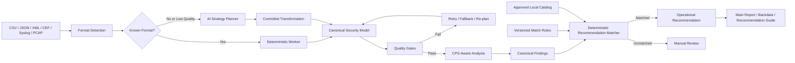

# CPS Security AI Workflow

[English](README.md) | [한국어](README.ko.md)

> **서로 다른 CPS·OT 보안 데이터를 AI로 해석·정형화하고, 분석 품질을 검증한 뒤 로컬에서 통제되는 조치 권고안으로 연결하는 하이브리드 보안 분석 워크플로우입니다.**

## 공개 저장소 범위

현재 이 저장소는 전체 CPS Security AI Workflow 중 **결정론적 권고안 제어 계층**을 공개합니다.

상위 워크플로우에는 멀티 포맷 입력, 신규 포맷에 대한 AI 전략 수립, Canonical Mapping, 품질 게이트 기반 정규화, CPS 관점의 Finding 생성, HTML/PDF 리포트 출력이 포함됩니다. 해당 구성요소는 본 문서에서 아키텍처 수준으로 설명하며, 현재 공개 저장소에서는 다음 기능을 실제 실행 가능한 코드로 제공합니다.

- 정규화된 Finding 입력 처리
- 결정론적 Rule Matching
- 로컬 권고안 카탈로그
- 미지원 Finding의 Fail-Closed 처리
- 카탈로그 무결성 및 도달성 검증
- 대표 CPS·OT 케이스 회귀 테스트

운영용 Prompt, 조직별 내부 지식, 고객 데이터, 세부 스코어 임계값을 공개하지 않으면서도 핵심 통제 구조를 검증할 수 있도록 구성했습니다.

## 검증 결과

```text
VALIDATION PASSED
- recommendations: 23
- enabled rules: 23
- tests: 25
- unreachable recommendations: 0
- dangling recommendation IDs: 0
```

## 빠른 실행

참조 매처와 검증 스크립트는 Python 표준 라이브러리만 사용합니다.

```bash
python validate_catalog.py
```

정규화된 Finding 매칭:

```bash
echo '{"finding_name":"WSD 검토 후보","protocol":"WSD","destination_port":3702}' \
  | python local_recommendation_matcher.py
```

출력 예시:

```json
{
  "match_status": "matched",
  "manual_review_required": false,
  "rule_id": "RULE-WSD",
  "recommendation_id": "REC-DISC-002"
}
```

---

## 프로젝트를 만든 이유

CPS·OT 보안 데이터는 하나의 안정적인 형식으로 들어오지 않습니다. 동일한 보안 근거라도 CSV, JSON, XML, CEF, Syslog, PCAP, 장비별 Export 보고서 또는 비정형 텍스트로 제공될 수 있습니다. 의미가 유사한 데이터라도 필드명, 프로토콜 표기, 세션 상태 및 레코드 경계가 서로 다릅니다.

고정 파서만으로는 모든 신규·비정형 데이터를 안정적으로 수용하기 어렵습니다. 반대로 LLM에 운영 권고안 생성을 전적으로 맡기면 실행할 때마다 조치 수준이 달라지거나, 불충분한 근거를 과도하게 해석하거나, 존재하지 않는 명령과 기능을 생성하거나, 실제 운영 제약을 무시할 수 있습니다.

따라서 이 프로젝트는 다음 네 가지 책임을 분리합니다.

1. **AI는 불확실하거나 비정형적인 데이터를 해석합니다.**
2. **결정론적 로직은 데이터 구조와 품질을 검증합니다.**
3. **CPS·OT 전문가 지식은 보안 분석의 문맥을 제공합니다.**
4. **승인된 로컬 정책은 최종 권고안을 통제합니다.**

> **AI는 근거를 해석할 수 있지만, 운영 조치를 임의로 발명하거나 승인할 권한은 갖지 않습니다.**

---

## 기술적 기여

### 1. CPS·OT 전문가 관점의 보안 분석 리포트

이 워크플로우는 단일 지표보다 실제 운영 문맥을 중심으로 설계되었습니다.

- 자산 역할
- Source/Destination 보안 Zone
- 프로토콜과 전송 계층
- 통신 방향
- 세션 상태
- Source/Destination 분포
- Baseline 변화
- 공정 영향 가능성

모든 이상 세션을 악성으로 단정하는 것이 아니라, 가정과 판단 경계가 명확한 CPS·OT Finding으로 전환하는 것을 목표로 합니다.

### 2. AI 기반 멀티 포맷 정형화

알려진 형식은 결정론적 Worker로 처리하고, 신규 또는 품질이 낮은 데이터는 제한된 AI 전략 수립 경로로 보낼 수 있습니다.

AI는 다음 처리 전략을 제안할 수 있습니다.

- 레코드 경계 탐지
- 필드 의미 추론
- Canonical Schema 매핑
- 값 정규화
- 비정형 레코드 재구성
- 변환 실패 원인 분석 및 Retry

AI가 문법적으로 올바른 JSON을 만들었다는 이유만으로 결과를 신뢰하지 않습니다. 변환 결과는 결정론적 품질 게이트를 통과해야 다음 단계로 전달됩니다.

### 3. 내부 승인 권고안 기반의 구체적 조치안

Finding은 버전 관리되는 로컬 권고안 카탈로그에 연결됩니다.

권고안은 다음 내용을 포함할 수 있습니다.

- 조치 목적
- 적용 대상
- 사전 확인 사항
- 단계별 조치
- 명령·설정 예시
- 적용 후 검증
- 운영 주의사항
- 변경관리와 롤백

LLM이 최종 조치를 자유롭게 작성하는 것이 아니라, 명시적인 Rule을 통해 승인된 Recommendation ID를 선택합니다.

### 4. 품질 게이트 기반 Retry와 Fallback

상위 워크플로우는 폐쇄형 재검증 구조를 지향합니다.

```text
최초 처리
  → 품질 평가
  → 통과: 다음 분석 단계
  → 실패: Retry / Fallback / AI 재정형화
  → 재평가
  → 유효한 최고 결과 채택 또는 수동 검토
```

이를 통해 파서 하나가 실패했다고 전체 분석이 종료되는 문제와, 품질이 낮은 결과가 정상 결론으로 출력되는 문제를 함께 줄입니다.

### 5. 원본 데이터부터 권고안까지의 추적성

다음 데이터 계보를 유지하는 구조입니다.

```text
원본 데이터
  → 포맷 탐지
  → 필드 매핑
  → 정규화
  → 세션 근거
  → Canonical Finding
  → Match Rule
  → Recommendation ID
```

이를 통해 오류 역추적, 품질 검토, 감사, 규칙 개선이 가능합니다.

### 6. AI와 결정론적 로직의 하이브리드 구조

| 처리 영역 | 주요 방식 |
|---|---|
| 알려진 포맷 파싱 | 결정론적 Worker |
| 신규 포맷 해석 | 제한된 AI 전략 수립 |
| Canonical Mapping | AI 보조 + 결정론적 검증 |
| 품질 평가와 Retry | 결정론적 정책 |
| CPS Finding 생성 | 도메인 규칙 + 정규화된 근거 |
| 권고안 선택 | 로컬 카탈로그 + Match Rule |
| 리포트 생성 | 구조화 JSON → HTML/PDF |

유연성이 필요한 영역에는 AI를 사용하고, 일관성·안전성·재현성이 필요한 영역은 코드와 정책으로 통제합니다.

### 7. Fail-Closed 처리

근거가 부족한 경우 적당한 권고안을 만들어내지 않습니다.

```json
{
  "match_status": "unmatched",
  "manual_review_required": true,
  "recommendation_id": null,
  "allow_generated_recommendation": false
}
```

`UDP 검토`, `SSL 검토`, `Attempt 상태 통신` 같은 일반 표현은 단독으로 권고안을 선택하는 근거가 되지 않습니다. 프로토콜, 포트, 통신 방향, Zone, 상태 또는 Risk Tag 등의 추가 근거가 필요합니다.

### 8. 카탈로그 도달성과 무결성 검증

Validator는 JSON 문법뿐 아니라 다음 항목을 검사합니다.

- 권고안 필수 필드
- Recommendation ID 일치 여부
- Rule ID 중복
- Priority 내림차순
- 존재하지 않는 Recommendation 참조
- 매칭 규칙이 없는 권고안
- 대표 매칭 및 미매칭 사례

이를 통해 카탈로그에 존재하지만 실제로는 선택되지 않는 죽은 권고안을 방지합니다.

---

## 전체 아키텍처



### 현재 공개 모듈

```text
Canonical Finding
  → 입력 정규화
  → Priority 기반 Match Rule
  → Recommendation ID
  → 승인 권고안 본문
  → 검증 및 리포트 연계
```

---

## Canonical Finding Model

Canonical Finding은 대표 세션과 그룹 전체의 사실을 분리합니다.

```json
{
  "finding_id": "FINDING-001",
  "finding_name": "WSD 검토 후보",
  "severity": "Medium",
  "session_count": 18,
  "representative_session": {
    "source_ip": "10.10.20.15",
    "destination_ip": "239.255.255.250",
    "protocol": "WSD",
    "transport": "UDP",
    "destination_port": 3702,
    "source_zone": "CONTROL",
    "destination_zone": "MULTICAST",
    "session_state": "OK"
  },
  "group_observations": {
    "protocols": ["WSD"],
    "destination_ports": [3702],
    "source_zones": ["CONTROL"],
    "destination_zones": ["MULTICAST"],
    "risk_tags": ["CROSS_ZONE", "DISCOVERY_TRAFFIC"]
  }
}
```

```text
Representative Session = 대상을 식별하기 위한 예시
Group Observations      = 그룹 전체에서 검증된 공통 사실
```

대표 세션 한 건의 포트·프로토콜·통신 방향이 전체 Finding의 공통 특성으로 잘못 일반화되는 것을 방지합니다.

---

## CPS·OT 분석 원칙

### 프로토콜은 판결문이 아님

프로토콜 이름 하나만으로 세션의 위험을 확정하지 않습니다.

```text
Protocol
+ Asset Role
+ Zone Direction
+ Port and Transport
+ Session State
+ Frequency and Distribution
+ Operational Purpose
```

### Discovery와 Multicast

WSD, SSDP, mDNS는 정상 서비스 검색 트래픽일 수 있습니다.

- 해당 자산이 서비스를 사용해야 하는가
- 의도한 Zone 안에서만 전달되는가
- 보안 경계를 넘어 Multicast가 Forwarding되는가
- 불필요한 자산에서 반복되는가
- 비활성화 시 Engineering·Printing·Management 기능에 영향이 있는가

### PLC Write와 제어 명령

PLC Write는 발생 빈도보다 승인 여부와 공정 영향이 중요합니다.

- 승인된 Engineering Workstation인가
- Maintenance Window와 Change Ticket이 존재하는가
- Controller Mode는 무엇이었는가
- 변경 전 Program Backup이 존재하는가
- 여러 PLC로 명령이 확산되었는가
- 변경 후 Alarm이나 Failure가 발생했는가

### Attempt, Reset, Incomplete

해당 상태는 공격 성공을 직접 의미하지 않습니다. 정책 차단, 폐기된 설정, Health Check, 비가용 서비스 또는 스캔일 수 있으므로 반복 주기, 분산도, 성공 세션 및 정책 문맥을 함께 검토합니다.

### Highly Connected Asset

Historian, Collector, Patch Server, DNS/NTP Server, Domain Service, Management System은 정상적으로 높은 연결 중심성을 가질 수 있습니다. 자산 역할과 실제 통신 패턴이 일치하는지 Baseline과 비교해야 합니다.

---

## 권고안 매칭 정책

Rule은 Priority 내림차순으로 평가하며, 가장 먼저 일치한 Rule이 Primary Recommendation을 선택합니다.

```text
정규화된 Finding
  → 활성 Rule
  → Priority 내림차순
  → 첫 번째 일치 Rule
  → recommendation_id
  → catalog.recommendations[recommendation_id]
```

런타임 Rule의 단일 기준:

```text
cps_recommendation_match_rules_v1_1.json
```

승인 권고안의 단일 기준:

```text
cps_recommendation_catalog_v1_1.json
```

카탈로그의 검색용 메타데이터는 설명과 검색 편의를 위한 값이며 런타임 Rule로 사용하지 않습니다.

---

## 저장소 구성

```text
.
├── README.md
├── README.ko.md
├── CHANGELOG_v1_1.md
├── cps_recommendation_catalog_v1_1.json
├── cps_recommendation_match_rules_v1_1.json
├── local_recommendation_matcher.py
├── validate_catalog.py
└── tests/
    └── matcher_cases_v1_1.json
```

| 파일 | 역할 |
|---|---|
| `cps_recommendation_catalog_v1_1.json` | 승인된 권고안 본문 |
| `cps_recommendation_match_rules_v1_1.json` | Finding → Recommendation 의사결정 Rule |
| `local_recommendation_matcher.py` | 입력 정규화와 참조 매처 |
| `validate_catalog.py` | 무결성·도달성·회귀 검증 |
| `tests/matcher_cases_v1_1.json` | 대표 매칭·미매칭 케이스 |
| `CHANGELOG_v1_1.md` | 버전 변경 내용 |

---

## 운영 안전 주의사항

> [!WARNING]
> 명령과 설정 예시는 보안 분석 및 변경 계획 수립을 위한 자료입니다. 자산 소유자 승인, 의존성 검토, 백업, 롤백 절차 및 승인된 Maintenance Window 없이 운영 CPS·OT 환경에서 실행해서는 안 됩니다.

보안 강화 조치는 가용성, 엔지니어링 접근, 레거시 장비 지원 또는 물리 공정에 영향을 줄 수 있습니다. 영향도가 가장 낮은 통제부터 검증해야 합니다.

---

## 연구 질문

이 프로젝트는 다음 연구 주제로 확장할 수 있습니다.

- AI Agent가 처음 보는 보안 데이터 형식을 정형화하면서 저품질 변환이 분석 파이프라인에 유입되지 않게 하려면 어떻게 해야 하는가?
- 안전 민감도가 높은 CPS·OT 환경에서 LLM의 유연성과 결정론적 검증을 어떻게 결합할 수 있는가?
- 정상 운영 행위와 공격 행위를 구분할 근거가 부족한 경우 불확실성을 어떤 구조로 표현해야 하는가?
- 권고안의 커버리지·일관성·설명 가능성을 LLM 응답 품질과 독립적으로 평가할 수 있는가?
- 검증된 정형화 전략을 구조가 유사한 신규 데이터에 어떤 조건에서 안전하게 재사용할 수 있는가?

---

## 현재 한계

- 공개 저장소에는 전체 멀티 포맷 오케스트레이션 Workflow가 포함되지 않습니다.
- 참조 매처는 Finding당 Primary Recommendation 하나를 선택합니다.
- 자산 중요도, Maintenance Window, 이중화 및 조직 정책은 별도의 운영 문맥이 필요합니다.
- 본 매처는 패킷 캡처 또는 위협 탐지 엔진이 아닙니다.
- 미지원 Finding은 LLM이 자동 확장하지 않고 수동 검토 대상으로 반환됩니다.
- 운영용 스코어 임계값, 내부 Prompt 및 조직별 지식은 공개하지 않습니다.

---

## 로드맵

- 합성 데이터를 사용하는 축약 멀티 포맷 정형화 데모
- Match Condition Trace 출력
- 모호성 및 Rule 충돌 회귀 테스트 확장
- Canonical Finding과 Recommendation JSON Schema
- 공개 Demo Catalog와 운영 Catalog 분리
- CPS·OT 보안 프레임워크 매핑 문서
- 합성 데이터 기반 리포트 샘플

---

## 설계 원칙

```text
AI Flexibility
+ Deterministic Validation
+ CPS/OT Expert Knowledge
+ Approved Local Recommendations
= Explainable and Actionable Security Reporting
```
