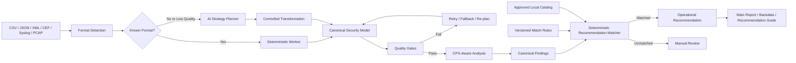

# CPS Security AI Workflow

[English](README.md) | [한국어](README.ko.md)

> **An AI-assisted CPS/OT security analysis workflow that normalizes heterogeneous security data, validates analysis quality, and maps findings to locally governed remediation recommendations.**

## Public Repository Scope

This repository currently publishes the **deterministic recommendation control layer** of a larger CPS Security AI Workflow.

The broader workflow includes multi-format ingestion, AI-assisted strategy planning for unknown formats, canonical mapping, quality-gated normalization, CPS-aware finding generation, and HTML/PDF reporting. Those components are described here at the architecture level, while this public repository provides runnable code for:

- normalized Finding input handling
- deterministic rule matching
- locally managed recommendation content
- fail-closed handling for unsupported findings
- catalog integrity and reachability validation
- regression tests for representative CPS/OT cases

The public code is intentionally designed to demonstrate the control architecture without exposing production prompts, organization-specific knowledge, customer data, or operational scoring thresholds.

## Validation Snapshot

```text
VALIDATION PASSED
- recommendations: 23
- enabled rules: 23
- tests: 25
- unreachable recommendations: 0
- dangling recommendation IDs: 0
```

## Quick Start

The reference matcher and validator use only the Python standard library.

```bash
python validate_catalog.py
```

Match a normalized Finding:

```bash
echo '{"finding_name":"WSD 검토 후보","protocol":"WSD","destination_port":3702}' \
  | python local_recommendation_matcher.py
```

Example result:

```json
{
  "match_status": "matched",
  "manual_review_required": false,
  "rule_id": "RULE-WSD",
  "recommendation_id": "REC-DISC-002"
}
```

---

## Why This Project Exists

CPS and OT security data rarely arrive in one stable format. The same operational evidence may be exported as CSV, JSON, XML, CEF, Syslog, PCAP, appliance-specific reports, or irregular text. Field names, protocol labels, session states, and record boundaries can differ even when the underlying security meaning is similar.

A fixed parser alone cannot reliably absorb every new or irregular source. At the same time, allowing an LLM to freely generate operational remediation creates another risk: recommendations may vary between runs, overstate incomplete evidence, invent unsupported commands, or ignore production constraints.

This project therefore separates four responsibilities:

1. **AI interprets uncertain or irregular data.**
2. **Deterministic logic validates structure and quality.**
3. **CPS/OT domain knowledge shapes the security analysis.**
4. **Approved local policy controls the final recommendation.**

> **The AI may interpret evidence, but it does not have authority to invent or approve production actions.**

---

## Technical Contributions

### 1. CPS/OT Expert-Guided Security Reporting

The workflow is designed around operational context rather than isolated indicators. Findings can consider:

- asset role
- source and destination security zones
- protocol and transport
- communication direction
- session state
- distribution across sources and destinations
- baseline deviation
- potential process impact

The goal is not to label every unusual session as malicious. The goal is to convert evidence into a reviewable CPS/OT security finding with clear assumptions, boundaries, and operational relevance.

### 2. AI-Assisted Multi-Format Normalization

Known formats can follow deterministic workers. Unknown or low-quality inputs can be routed to a constrained AI strategy-planning stage that proposes how to:

- detect record boundaries
- infer field meaning
- map source fields to a canonical schema
- normalize values
- restructure irregular records
- retry after a failed transformation

AI output is not trusted solely because it is syntactically valid. The transformed result must pass deterministic quality gates before it proceeds.

### 3. Locally Governed Remediation Recommendations

Findings are mapped to versioned, pre-approved recommendation content stored in a local catalog.

A recommendation can include:

- remediation objective
- affected targets
- prerequisite checks
- staged action steps
- command or configuration examples
- post-change validation
- operational cautions
- rollback and change-management guidance

The LLM does not freely compose the final production action. The matcher selects a known recommendation ID through explicit rules.

### 4. Quality-Gated Retry and Fallback

The broader workflow is designed as a closed-loop processing system:

```text
Initial Processing
  → Quality Evaluation
  → Pass: Continue
  → Fail: Retry / Fallback / AI Restructuring
  → Re-evaluation
  → Accept Best Valid Result or Require Manual Review
```

This reduces two failure modes:

- stopping the entire analysis because one parser failed
- treating a low-quality result as a valid security conclusion

### 5. Traceability from Evidence to Recommendation

The architecture preserves the relationship between:

```text
Original Data
  → Format Detection
  → Field Mapping
  → Normalization
  → Session Evidence
  → Canonical Finding
  → Match Rule
  → Recommendation ID
```

This supports debugging, quality review, auditability, and future rule improvement.

### 6. Hybrid AI and Deterministic Architecture

| Processing area | Primary approach |
|---|---|
| Known-format parsing | deterministic worker |
| Unknown-format interpretation | constrained AI strategy planning |
| Canonical mapping | AI assistance + deterministic validation |
| Quality scoring and retry | deterministic policy |
| CPS-aware finding generation | domain rules + normalized evidence |
| Recommendation selection | local catalog + deterministic match rules |
| Report generation | structured JSON → HTML/PDF |

This design uses AI where flexibility is valuable and deterministic logic where consistency, safety, and reproducibility are required.

### 7. Fail-Closed Handling

If the evidence is insufficient, the system does not invent a recommendation.

```json
{
  "match_status": "unmatched",
  "manual_review_required": true,
  "recommendation_id": null,
  "allow_generated_recommendation": false
}
```

Generic labels such as `UDP review`, `SSL review`, or `Attempt session` are not considered sufficient triggers by themselves. Additional evidence such as protocol, port, direction, zone, state, or risk tags is required.

### 8. Catalog Reachability and Integrity Validation

The validator checks more than JSON syntax. It verifies:

- required recommendation fields
- recommendation ID consistency
- rule ID uniqueness
- descending priority order
- invalid recommendation references
- unreachable recommendations
- representative match and non-match cases

This prevents recommendations from silently becoming dead catalog entries.

---

## Architecture



### Current Public Module

```text
Canonical Finding
  → Normalization
  → Priority-Ordered Match Rules
  → Recommendation ID
  → Approved Recommendation Content
  → Validation / Reporting Integration
```

---

## Canonical Finding Model

A canonical Finding separates a representative session from group-level facts.

```json
{
  "finding_id": "FINDING-001",
  "finding_name": "WSD 검토 후보",
  "severity": "Medium",
  "session_count": 18,
  "representative_session": {
    "source_ip": "10.10.20.15",
    "destination_ip": "239.255.255.250",
    "protocol": "WSD",
    "transport": "UDP",
    "destination_port": 3702,
    "source_zone": "CONTROL",
    "destination_zone": "MULTICAST",
    "session_state": "OK"
  },
  "group_observations": {
    "protocols": ["WSD"],
    "destination_ports": [3702],
    "source_zones": ["CONTROL"],
    "destination_zones": ["MULTICAST"],
    "risk_tags": ["CROSS_ZONE", "DISCOVERY_TRAFFIC"]
  }
}
```

```text
Representative Session = an example used to identify the target
Group Observations      = facts verified across the grouped sessions
```

This distinction prevents one representative session from being incorrectly generalized to the entire Finding group.

---

## CPS/OT Analysis Principles

### Protocol Is Not a Verdict

A protocol name alone is not enough to classify a session. Analysis should consider:

```text
Protocol
+ Asset Role
+ Zone Direction
+ Port and Transport
+ Session State
+ Frequency and Distribution
+ Operational Purpose
```

### Discovery and Multicast Traffic

WSD, SSDP, and mDNS may be legitimate discovery traffic. Relevant review questions include:

- Is the source asset expected to use the service?
- Does the traffic remain inside the intended zone?
- Is multicast being forwarded across security boundaries?
- Is the traffic generated by devices that do not require discovery?
- Would disabling the service affect engineering, printing, management, or maintenance?

### PLC Write and Control Commands

PLC write activity should be evaluated using operational approval and process impact, not frequency alone.

Relevant evidence includes:

- approved engineering workstation
- maintenance window
- change ticket
- controller mode
- program backup
- affected PLC count
- alarms or failures after the change

### Attempt, Reset, and Incomplete Sessions

These states do not independently prove a successful attack. They may represent blocked access, stale configuration, health checks, unavailable services, or scanning. Distribution, repetition, successful follow-up sessions, and policy context must be reviewed together.

### Highly Connected Assets

High connection centrality can be normal for historians, collectors, patch servers, DNS/NTP servers, domain services, or management systems. Analysis should compare the observed communication pattern with the expected role and baseline.

---

## Recommendation Policy

Rules are evaluated in descending priority order. The first matching rule selects the primary recommendation.

```text
normalized Finding
  → enabled rules
  → priority descending
  → first matching rule
  → recommendation_id
  → catalog.recommendations[recommendation_id]
```

The runtime rule source is:

```text
cps_recommendation_match_rules_v1_1.json
```

The approved recommendation source is:

```text
cps_recommendation_catalog_v1_1.json
```

Catalog search metadata is descriptive and must not be treated as a runtime match rule.

---

## Repository Contents

```text
.
├── README.md
├── README.ko.md
├── CHANGELOG_v1_1.md
├── cps_recommendation_catalog_v1_1.json
├── cps_recommendation_match_rules_v1_1.json
├── local_recommendation_matcher.py
├── validate_catalog.py
└── tests/
    └── matcher_cases_v1_1.json
```

| File | Purpose |
|---|---|
| `cps_recommendation_catalog_v1_1.json` | approved recommendation content |
| `cps_recommendation_match_rules_v1_1.json` | Finding-to-recommendation decision rules |
| `local_recommendation_matcher.py` | reference normalization and matcher implementation |
| `validate_catalog.py` | integrity, reachability, and regression validation |
| `tests/matcher_cases_v1_1.json` | representative matched and unmatched cases |
| `CHANGELOG_v1_1.md` | version changes |

---

## Operational Safety

> [!WARNING]
> Command and configuration examples are provided for security analysis and change planning. They must not be executed in a production CPS/OT environment without asset-owner approval, dependency analysis, backups, rollback procedures, and an approved maintenance window.

Security-hardening actions can affect availability, engineering access, legacy device support, or physical process operation. The least disruptive control should be tested first.

---

## Research Questions

This project is also intended as a foundation for further research:

- How can an AI agent normalize previously unseen security formats without allowing low-quality transformations into the analysis pipeline?
- How can LLM flexibility be combined with deterministic validation in safety-sensitive CPS/OT operations?
- How should uncertainty be represented when the available traffic evidence cannot distinguish benign operational behavior from malicious activity?
- How can recommendation coverage, consistency, and explainability be evaluated independently from LLM response quality?
- When can a previously validated normalization strategy be safely reused for structurally similar data?

---

## Current Limitations

- The public repository does not include the complete multi-format orchestration workflow.
- The reference matcher selects one primary recommendation per Finding.
- Asset criticality, maintenance windows, redundancy, and local policy require external operational context.
- The matcher is not a packet capture or threat detection engine.
- Unsupported Findings are returned for manual review rather than automatically expanded by an LLM.
- Production scoring thresholds, internal prompts, and organization-specific knowledge are not included.

---

## Roadmap

- publish a reduced synthetic multi-format normalization demo
- add explicit match-condition traces
- expand regression tests for ambiguity and rule conflicts
- add JSON Schema validation for canonical Findings and recommendations
- separate public demo catalog from production knowledge
- document mappings to established CPS/OT security frameworks
- integrate report samples using synthetic data

---

## Design Principle

```text
AI Flexibility
+ Deterministic Validation
+ CPS/OT Expert Knowledge
+ Approved Local Recommendations
= Explainable and Actionable Security Reporting
```
