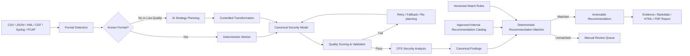

# CPS Security Multi-Format AI Analysis & Recommendation Workflow

> **CPS·OT 환경의 이기종 보안 데이터를 AI가 해석·정형화하고, CPS 전문가 지식과 내부 승인 권고안을 기반으로 분석 결과부터 구체적인 조치안까지 연결하는 하이브리드 보안 분석 워크플로우입니다.**

CPS(Cyber-Physical System) 보안 분석 현장에서는 동일한 보안 정보라도 CSV, JSON, XML, CEF, Syslog, PCAP, 장비별 Export 파일처럼 서로 다른 형태로 제공됩니다. 컬럼명, 데이터 구조, 프로토콜 표기와 세션 상태가 제각각이기 때문에, 사전에 정의된 고정 파서만으로는 신규 데이터나 비정형 데이터를 안정적으로 분석하기 어렵습니다.

또한 범용 LLM에 보안 권고안 생성을 전적으로 맡기면 분석할 때마다 표현과 조치 수준이 달라지거나, 근거가 부족한 명령·제품 기능·운영 절차가 생성될 수 있습니다. 탐지 결과는 얻었지만 실제 현장에서 **무엇을 확인하고, 어떤 순서로 조치하며, 어떻게 검증해야 하는지**까지 연결되지 않는 경우도 많습니다.

이 프로젝트는 이러한 문제를 해결하기 위해 다음 원칙으로 설계되었습니다.

- **비정형성과 신규 포맷은 AI의 유연성으로 해석합니다.**
- **반복 가능한 처리 영역은 코드·스키마·점수 기반 로직으로 통제합니다.**
- **보안 판단에는 CPS 전문가의 분석 기준을 반영합니다.**
- **최종 조치안은 내부 승인 권고 데이터에서 결정론적으로 선택합니다.**
- **분석 실패와 불확실성을 숨기지 않고 재처리 또는 수동 검토 대상으로 분리합니다.**

---

## 주요 특장점

### 1. CPS 전문가 지식 기반의 보안 분석 리포트

범용 IT 보안 관점에 머무르지 않고 CPS·OT 환경의 자산 역할, 산업 프로토콜, Zone 간 통신 방향, 세션 상태와 운영 영향도를 고려하여 분석 결과를 구성합니다.

단순히 "이상 통신이 존재한다"는 사실을 나열하는 것이 아니라 다음 내용을 함께 제시하는 것을 목표로 합니다.

- 분석 대상과 대표 세션
- 전체 세션 분포와 공통 특성
- 프로토콜·포트·통신 방향
- CPS 환경에서의 위험 의미
- 확인이 필요한 자산과 운영 조건
- 우선 조치 방향과 검증 기준

이를 통해 탐지 이벤트를 CPS 운영자가 이해하고 검토할 수 있는 **보안 분석 리포트**로 전환합니다.

### 2. AI 기반 멀티 포맷 및 비정형 데이터 정형화

CSV, JSON, XML, CEF, Syslog, PCAP 등 서로 다른 입력 포맷을 공통 분석 스키마로 정규화합니다. 이미 정의된 포맷은 검증된 코드 경로로 처리하고, 신규 확장자나 구조가 일정하지 않은 비정형 데이터는 AI가 데이터의 특징을 판단하여 처리 전략을 수립합니다.

AI는 통제된 범위에서 다음 역할을 수행할 수 있습니다.

1. 입력 데이터의 구조와 포맷 특성 판단
2. 헤더·필드·레코드 경계 추론
3. 표준 보안 필드와 원본 필드의 의미 매핑
4. 필요한 변환·정제 전략 수립
5. 정형화 결과 생성
6. 품질 평가 결과에 따른 재시도 전략 보완

정형화된 결과는 포맷별 개별 리포트가 아니라 하나의 **Canonical Security Model**로 연결되어 동일한 분석·Finding·권고·리포트 파이프라인을 사용합니다.

### 3. 내부 권고 데이터 기반의 구체적인 조치안 출력

분석 결과를 범용적인 설명으로 끝내지 않고, 내부에서 관리하는 승인 권고안 카탈로그와 연결하여 실제 운영자가 검토할 수 있는 조치안을 출력합니다.

권고안에는 필요에 따라 다음 항목이 포함됩니다.

- 조치 목적과 적용 대상
- 사전 확인 사항
- 단계별 조치 절차
- 설정 또는 명령 예시
- 조치 후 검증 방법
- 서비스 영향과 운영 주의사항
- 변경관리 및 롤백 고려사항

LLM이 조치 내용을 자유롭게 발명하는 대신, 분석된 Finding을 결정론적 규칙으로 승인 권고안에 연결합니다. 이를 통해 결과의 일관성, 감사 가능성, 운영 신뢰도를 높입니다.

### 4. 분석 품질 자동 검증과 반복 보정

AI 또는 파서가 결과를 한 번 생성하고 종료하는 구조가 아닙니다. 포맷 탐지, 필드 매핑, 정규화, 세션 구성과 분석 결과를 단계별로 평가하고, 기준에 미달한 경우 Retry·Fallback·AI 재정형화 경로로 다시 처리합니다.

```text
Initial Processing
  → Quality Scoring
  → Pass: Continue Analysis
  → Fail: Retry / Fallback / AI Restructuring
  → Re-scoring
  → Best Result or Manual Review
```

이 구조는 처리 성공률만 높이는 것이 아니라, 낮은 품질의 결과가 정상 분석 결과처럼 출력되는 것을 방지합니다.

### 5. 원본 데이터부터 권고안까지의 추적성과 설명 가능성

최종 보고서만 남기는 것이 아니라 각 분석 단계의 근거와 데이터 계보를 유지합니다.

- 어떤 포맷으로 탐지되었는가
- 어떤 원본 필드가 표준 필드에 매핑되었는가
- 어떤 정규화와 보정이 적용되었는가
- 어떤 세션과 위험 태그가 Finding의 근거가 되었는가
- 어떤 규칙이 권고안을 선택했는가
- 어떤 값이 관찰 사실이고 어떤 값이 추론 결과인가

이를 통해 분석 오류를 역추적하고, 권고안이 선택된 이유를 설명하며, 향후 규칙과 카탈로그를 개선할 수 있습니다.

### 6. AI와 결정론적 로직을 결합한 하이브리드 아키텍처

모든 판단을 LLM에 맡기거나 모든 입력 포맷을 정적 코드로 고정하지 않습니다. 각 기술이 잘하는 영역을 분리합니다.

| 처리 영역 | 주요 방식 |
|---|---|
| 알려진 포맷 파싱·변환 | 정적 코드 및 검증된 Worker |
| 신규·비정형 구조 해석 | AI 기반 구조 판단 및 전략 수립 |
| 필드 매핑과 정규화 | AI 보조 + 규칙·점수 기반 검증 |
| 품질 판정과 Retry | 결정론적 Score 및 Routing |
| Finding 생성 | CPS 분석 기준 및 정규화된 세션 근거 |
| 조치 권고안 선택 | 내부 카탈로그 + 결정론적 Match Rule |
| 보고서 출력 | 표준 JSON 기반 HTML/PDF Rendering |

이러한 분리를 통해 AI의 적응성과 규칙 기반 시스템의 재현성·통제 가능성을 동시에 확보합니다.

### 7. 신규 포맷에 대한 적응형 확장성

신규 데이터 구조가 입력될 때마다 전체 파이프라인을 새로 개발하지 않아도 됩니다. AI가 기존 표준 스키마로 변환할 수 있는 처리 전략을 제안하고 실행 결과를 검증하여, 지원 가능한 포맷을 점진적으로 확대할 수 있습니다.

반복적으로 검증된 전략은 향후 재사용 가능한 코드·매핑 템플릿·프로파일로 전환할 수 있어, 시스템이 운영 과정에서 처리 역량을 축적하는 구조로 확장할 수 있습니다.

### 8. 다단계 Fallback과 명시적인 불확실성 관리

분석 실패 시 워크플로우 전체를 즉시 중단하거나, 알 수 없는 값을 임의로 채우지 않습니다.

```text
Primary Parser
  → Retry
  → Alternate Parser or Strategy
  → AI Restructuring
  → Re-validation
  → Best Available Result
  → Manual Review Required
```

미매칭 또는 품질 미달 상태는 명확한 상태값과 검토 필요 여부로 남기며, 승인되지 않은 권고안을 임의 생성하지 않습니다.

### 9. Detection에서 Recommendation까지 이어지는 End-to-End 처리

일반적인 분석 도구가 탐지 또는 데이터 정형화 단계에서 끝나는 것과 달리, 이 워크플로우는 다음 전체 과정을 하나의 흐름으로 연결하는 것을 목표로 합니다.

```text
Data Ingestion
  → Format Detection
  → Parsing & Normalization
  → Session Analysis
  → Finding Generation
  → Recommendation Matching
  → Evidence & Backdata
  → HTML / PDF Report
```

분석 결과와 근거 세션, 위험 의미, 조치 권고와 검증 절차를 함께 제공하여 보안 분석 결과를 실제 운영 검토 단계까지 연결합니다.

### 10. 로컬·온프레미스 지향 운영

CPS 데이터에는 내부 IP, Zone 구성, 산업 프로토콜, 설비 자산과 취약 서비스 등 민감한 정보가 포함될 수 있습니다. 권고 카탈로그와 결정론적 매칭 로직을 로컬에서 운용하여, 최소한 최종 권고안 선택 단계는 외부 추론 서비스에 의존하지 않도록 설계할 수 있습니다.

배포 환경에 따라 로컬 LLM, 사내 LLM API 또는 외부 모델을 선택할 수 있으며, 민감 데이터의 처리 범위와 모델 전송 범위를 조직 정책에 맞게 통제할 수 있습니다.

---

## 전체 처리 구조



---

## 핵심 설계 원칙

> **AI는 데이터를 해석하고 처리 전략을 수립할 수 있지만, 운영 조치를 임의로 확정하지 않습니다.**

AI는 비정형 데이터의 해석과 표준화에 유연성을 제공하고, 품질 점수와 검증 로직은 처리 결과를 통제합니다. 최종 권고안은 버전 관리되는 내부 카탈로그와 매칭 정책에서 선택됩니다.

```text
AI Flexibility
+ Deterministic Validation
+ CPS Expert Knowledge
+ Approved Recommendation Catalog
= Explainable and Actionable CPS Security Reporting
```

---

## CPS·OT 분석에서 중요하게 보는 실무 문맥

CPS 보안 분석은 포트 번호나 프로토콜 이름만으로 위험을 확정하기 어렵습니다. 동일한 통신이라도 **자산 역할, 통신 방향, Zone 경계, 세션 상태, 발생 빈도, 운영 목적**에 따라 의미가 달라집니다.

| 분석 관점 | 단순 해석의 위험 | 이 워크플로우의 판단 방향 |
|---|---|---|
| 프로토콜 | 특정 프로토콜 사용 자체를 악성으로 단정 | 프로토콜의 목적, 암호화 여부, 자산 역할과 허용 정책을 함께 확인 |
| 포트 | Well-known Port만으로 서비스 확정 | 실제 식별 프로토콜, 전송 계층, Source/Destination 관계와 교차 검증 |
| 통신 방향 | 내부→외부 또는 외부→내부만으로 위험 확정 | Zone 경계, Initiator, 응답 여부와 업무상 필요성을 함께 평가 |
| 세션 상태 | `Attempt`를 침해 성공으로 해석 | 반복 횟수, 대상 분산도, 성공 세션 존재 여부와 정책 차단 여부를 구분 |
| 연결 수 | 고연결 자산을 스캐너로 단정 | 수집 서버, Historian, Domain Service, 관리 서버 등 정상 허브 역할 여부 확인 |
| 멀티캐스트 | Discovery 트래픽을 곧바로 공격으로 판단 | 동일 Zone 내 정상 검색인지, 불필요한 Zone 간 확산인지 구분 |
| 대표 세션 | 대표 1건의 포트·프로토콜을 전체 그룹에 일반화 | 대표 세션과 전체 그룹의 공통 특성을 별도 필드로 관리 |
| 조치 권고 | 탐지 즉시 차단·서비스 중지 권고 | 운영 의존성, 이중화, 정비 창구, 롤백 가능성을 확인한 뒤 단계적으로 적용 |

예를 들어 WSD·SSDP·mDNS와 같은 Discovery 트래픽은 그 자체로 악성이라고 볼 수 없습니다. 그러나 제어망과 업무망 사이의 Zone 경계를 넘어 반복적으로 전달되거나, 사용하지 않는 설비에서 광범위하게 관찰된다면 불필요한 서비스 탐색과 네트워크 노출 관점에서 검토 대상이 됩니다.

반대로 PLC Write, 온라인 프로그램 변경, 제어 명령과 같은 행위는 발생 빈도가 낮더라도 공정 영향도가 클 수 있습니다. 이 경우 단순 차단보다 **승인된 엔지니어링 스테이션 여부, 작업 시간, 변경 티켓, Controller Mode와 변경 전후 상태**를 우선 검증해야 합니다.

---

## Workflow Components

전체 워크플로우는 각 단계의 책임과 실패 경계를 분리하여 구성됩니다.

| 구성요소 | 역할 | 주요 통제 포인트 |
|---|---|---|
| **Input Detector** | 확장자와 실제 콘텐츠를 비교하여 입력 형식 식별 | 확장자만 신뢰하지 않고 헤더·구조·Magic Byte·레코드 패턴 확인 |
| **Known-Format Worker** | CSV, JSON, XML, CEF, Syslog, PCAP 등 검증된 경로 처리 | 포맷별 파싱 결과와 원본 Lineage 유지 |
| **AI Strategy Planner** | 신규·비정형 데이터의 구조와 처리 방법 수립 | 제한된 실행 범위, 입력·출력 계약, 실행 후 품질 재검증 |
| **Canonical Mapper** | 서로 다른 원본 필드를 공통 보안 필드로 변환 | 필수 필드, 타입, 값 범위와 원본 필드 매핑 근거 기록 |
| **Quality Gate** | 탐지·매핑·정규화 결과 평가 | 기준 미달 시 Retry, Fallback 또는 재전략 수립 |
| **Session Analyzer** | 통신 관계, 세션 상태, 프로토콜과 Zone 문맥 분석 | 대표 세션과 전체 그룹 통계를 분리 |
| **Finding Builder** | 반복 가능한 Canonical Finding 생성 | 관찰 사실과 해석·위험 태그의 경계 유지 |
| **Recommendation Matcher** | Finding을 승인된 내부 권고안에 연결 | 우선순위, 다중 조건, Fail-Closed, 버전 관리 |
| **Report Renderer** | 분석 결과와 Backdata를 HTML/PDF 문서로 변환 | Finding ID를 기준으로 본문·근거·권고 문서 연결 |

### AI가 담당하는 영역과 담당하지 않는 영역

| AI가 수행할 수 있는 작업 | AI가 단독으로 확정하지 않는 작업 |
|---|---|
| 신규 데이터 구조 해석 | 실제 침해 여부 최종 확정 |
| 필드 의미 후보와 변환 전략 제안 | 운영 서비스 중지 또는 방화벽 차단 승인 |
| 비정형 레코드의 정형화 | 존재하지 않는 제품 명령이나 기능 생성 |
| 실패 원인 분석과 Retry 전략 제안 | 근거가 부족한 권고안 임의 선택 |
| 분석 설명문 초안 생성 | 자산 소유자·공정 영향도·정비 가능 시간 추정 |

이 경계를 통해 AI는 **해석과 적응성**을 제공하고, 실제 운영 결정은 검증된 코드·정책·전문가 검토 체계 안에 남도록 합니다.

---

## Canonical Security Model

입력 포맷별 차이를 제거하기 위해 분석 결과를 공통 모델로 변환합니다. 아래는 상위 워크플로우에서 사용할 수 있는 Canonical Finding의 개념 예시입니다.

```json
{
  "finding_id": "FINDING-001",
  "finding_name": "WSD 검토 후보",
  "target": "WS-Discovery 통신 검토",
  "severity": "Medium",
  "session_count": 18,
  "representative_session": {
    "source_ip": "10.10.20.15",
    "destination_ip": "239.255.255.250",
    "protocol": "WSD",
    "transport": "UDP",
    "destination_port": 3702,
    "source_zone": "CONTROL",
    "destination_zone": "MULTICAST",
    "session_state": "OK"
  },
  "group_observations": {
    "protocols": ["WSD"],
    "destination_ports": [3702],
    "source_zones": ["CONTROL"],
    "destination_zones": ["MULTICAST"],
    "risk_tags": ["CROSS_ZONE", "DISCOVERY_TRAFFIC"]
  },
  "recommendation_match": {
    "rule_id": "RULE-WSD",
    "recommendation_id": "REC-DISC-002",
    "manual_review_required": false
  }
}
```

> 위 JSON은 데이터 계약을 설명하기 위한 개념 예시입니다. 실제 배포본에서는 워크플로우 버전과 렌더러 요구사항에 따라 필드가 확장될 수 있습니다.

### 대표 세션과 그룹 사실의 분리

대표 세션은 사용자가 대상을 빠르게 식별하기 위한 예시입니다. 대표 세션 한 건에 포함된 포트, 프로토콜, 방향을 전체 Finding의 공통 사실로 확대 해석하지 않습니다.

```text
Representative Session = 식별을 위한 사례
Group Observations      = 전체 세션에서 검증된 공통 특성
```

이 구분은 다양한 프로토콜과 포트가 하나의 Finding 그룹에 포함될 때, 보고서가 실제 데이터보다 과도하게 일반화되는 문제를 줄입니다.

---

## Quality Gates and Recovery Strategy

각 처리 단계는 독립적인 품질 게이트를 가지며, 단순히 JSON이 생성됐다는 이유만으로 다음 단계에 전달하지 않습니다.

| Gate | 주요 검증 항목 | 실패 시 처리 |
|---|---|---|
| **Detection Gate** | 포맷 후보, 콘텐츠 시그니처, 파서 적합성 | 대체 Detector 또는 신규 포맷 경로 |
| **Parsing Gate** | 레코드 수, 필드 일관성, 파싱 오류율 | 파서 옵션 변경 또는 Retry |
| **Mapping Gate** | 필수 보안 필드 매핑, 타입 적합성, 원본 근거 | AI 매핑 보조 또는 보수적 Passthrough |
| **Normalization Gate** | IP·Port·Protocol·Timestamp·State 정규화 | 보정 후 재평가, 최고 품질 결과 유지 |
| **Finding Gate** | 세션 근거, 그룹화 일관성, 위험 태그 타당성 | Finding 축소·분리 또는 수동 검토 |
| **Recommendation Gate** | Match Rule 충족, Recommendation ID 유효성 | 임의 생성 없이 Manual Review |
| **Rendering Gate** | Finding ID 연결, 필수 출력 항목, 문서 무결성 | 보고서 생성 중단 또는 오류 명시 |

### Known Format과 AI 경로의 공존

검증된 장비 Export나 CTD Baseline과 같이 신뢰 가능한 템플릿은 원본 Detector와 Canonical Mapping을 우선 사용할 수 있습니다. 이때 AI 정규화 결과가 비어 있다는 이유만으로 실패 처리하지 않고, 사전에 검증된 매핑을 **Authoritative Mapping**으로 인정할 수 있습니다.

반면 신규 형식이나 구조가 불안정한 TXT·LOG 데이터는 고정 파서 결과가 반복적으로 품질 기준에 미달할 경우 AI 재정형화 경로로 전환합니다. 재정형화 후에도 품질이 충분하지 않다면, 가장 높은 품질의 결과와 함께 불확실성 및 수동 검토 필요 여부를 명시합니다.

```text
Known and Trusted Format
  → Deterministic Mapping
  → Authoritative Validation

Unknown or Low-Quality Format
  → AI Restructuring
  → Deterministic Re-scoring
  → Accept / Retry / Manual Review
```

---

## Practical Analysis Logic

### 1. Protocol + Direction + Asset Role

프로토콜 이름 하나만으로 위험도를 확정하지 않습니다. 동일한 SMB 통신이라도 Engineering Workstation에서 승인된 File Server로 전달되는 경우와, 제어 장비에서 외부 Zone으로 직접 전달되는 경우는 다르게 평가해야 합니다.

```text
Protocol Context
= Protocol
+ Source/Destination Role
+ Zone Direction
+ Port and Transport
+ Session State
+ Frequency and Distribution
```

### 2. Discovery and Multicast Traffic

SSDP, WSD, mDNS 등은 정상 서비스 검색에도 사용되므로 기본적으로 악성 시그니처로 취급하지 않습니다. 대신 다음 조건을 검토합니다.

- 사용 목적이 확인된 자산에서 발생했는가
- 동일 Zone 안에서만 전달되는가
- 라우터 또는 방화벽을 넘어 다른 보안 Zone으로 확산되는가
- 불필요한 장비에서 반복적으로 발생하는가
- 서비스 비활성화 시 설비 검색·프린팅·관리 기능에 영향이 있는가

권고안은 즉시 차단보다 자산 식별, 서비스 의존성 확인, Zone 경계 필터링, 변경 후 모니터링 순으로 구성하는 것이 안전합니다.

### 3. PLC Write and Control Commands

PLC Write나 온라인 프로그램 변경은 빈도보다 **공정 영향도와 승인 여부**가 중요합니다.

확인해야 할 항목은 다음과 같습니다.

- Source가 승인된 Engineering Workstation인가
- 작업 시간과 변경관리 기록이 일치하는가
- Controller가 RUN/PROGRAM 중 어떤 상태였는가
- 변경 전 백업과 롤백 절차가 존재하는가
- 동일 Source에서 다수 PLC로 변경 명령이 확산되었는가
- 변경 직후 공정 알람·통신 장애·다운로드 이벤트가 동반되었는가

따라서 네트워크 차단만 권고하기보다 자산 소유자, 제어 엔지니어, 보안 담당자의 공동 검증 절차가 필요합니다.

### 4. Attempt, Reset and Incomplete Sessions

`Attempt`, `Reset`, `Incomplete` 같은 상태는 단독으로 공격 성공을 의미하지 않습니다.

- 방화벽이나 ACL에 의해 정상적으로 차단된 연결일 수 있음
- 서비스가 존재하지 않거나 장비가 응답하지 않은 상태일 수 있음
- 잘못된 설정, 폐기된 서버 주소 또는 주기적 Health Check일 수 있음
- 짧은 시간 동안 다수 대상에 분산되면 탐색·스캔 가능성이 높아질 수 있음

따라서 성공 세션 존재 여부, 반복 주기, Source/Destination 분산도와 허용 정책을 함께 확인합니다.

### 5. Highly Connected Assets

많은 자산과 연결되는 노드는 반드시 공격자가 아닙니다. Historian, SIEM Collector, Patch Server, Domain Controller, NTP/DNS Server와 같은 정상 인프라는 높은 연결 중심성을 가질 수 있습니다.

고연결 자산 분석에서는 다음을 구분합니다.

- 알려진 서버 역할에 부합하는 연결인가
- 사용 프로토콜과 포트가 역할에 일치하는가
- 기존 Baseline보다 연결 대상이 급격히 증가했는가
- 단방향 시도만 증가했는가, 정상 응답 세션도 존재하는가
- OT 자산에서 인터넷 또는 비인가 Zone으로 직접 연결되는가

---

## Recommendation Design for Production Environments

권고안은 보안적으로 가장 강한 조치만 나열하지 않고, 실제 운영 환경에서 적용 가능한 순서로 구성합니다.

```text
1. Validate the Evidence
2. Identify Asset Owner and Operational Purpose
3. Confirm Dependency and Maintenance Window
4. Apply the Least Disruptive Control First
5. Verify Security and Process Impact
6. Escalate or Roll Back Based on the Result
```

### 권고안에 포함하는 운영 요소

- **사전 확인:** 자산 역할, 서비스 소유자, 통신 필요성, 변경 티켓
- **우선 조치:** 모니터링, Scope 제한, ACL·방화벽 정책 검토, 불필요 서비스 확인
- **적용 조치:** 서비스 설정 변경, 프로토콜 업그레이드, Zone 경계 통제
- **검증:** 세션 감소 여부, 정상 업무 영향, 장비 알람과 공정 상태
- **롤백:** 원복 조건, 설정 백업, 장애 발생 시 책임자와 복구 절차

예를 들어 FTP, Telnet, SMBv1과 같은 Legacy Protocol은 보안상 제거가 바람직하지만, 구형 PLC·HMI·관리 장비가 이를 유지보수 경로로 사용할 수 있습니다. 따라서 즉시 비활성화하기 전에 대체 프로토콜 지원 여부, Firmware 제약, Vendor Support와 정비 절차를 확인해야 합니다.

---

## Reporting Structure

최종 결과는 한 개의 요약 리포트와 근거·권고 문서를 `Finding ID`로 연결하는 구조를 지향합니다.

```text
Main Security Report
├─ Executive Summary
├─ Risk Distribution
├─ Major Findings
└─ Representative Sessions

Session Backdata
├─ Finding ID
├─ Original and Normalized Fields
├─ Session Evidence
└─ Group Statistics

Recommendation Detail Guide
├─ Finding ID
├─ Recommendation ID
├─ Analysis Rationale
├─ Action Steps
├─ Verification
└─ Operational Notes / Rollback
```

이 구조를 사용하면 경영·관리자는 요약 결과를 확인하고, 분석가는 Session Backdata를 검증하며, 운영 담당자는 동일한 Finding ID를 기준으로 구체적인 조치 절차를 확인할 수 있습니다.

---

## Versioning, Governance and Auditability

운영 환경에서 권고안은 코드와 동일하게 변경관리 대상입니다.

- Catalog와 Match Rule을 독립적으로 버전 관리
- Recommendation ID와 Rule ID의 영속성 유지
- 신규 규칙 추가 시 기존 Finding 회귀 테스트 수행
- 권고 문구 변경 시 기술 담당자와 운영 담당자의 검토 기록 유지
- 미도달 권고안과 존재하지 않는 Recommendation 참조 자동 검증
- 미매칭 Finding을 향후 카탈로그 확장 후보로 축적
- 보고서에 사용된 Catalog/Rule 버전을 결과 메타데이터로 보존

권고안이 변경되더라도 과거 보고서가 어떤 버전의 지식과 규칙을 사용했는지 추적할 수 있어야 합니다. 이는 단순 재현성을 넘어 고객 설명, 내부 감사, 품질 개선에 필요한 근거가 됩니다.

---

## Example: WSD Finding to Operational Recommendation

아래 예시는 정규화된 Finding이 로컬 권고안으로 연결되는 흐름을 보여줍니다.

```json
{
  "finding_name": "WSD 검토 후보",
  "protocol": "WS-DISCOVERY",
  "destination_port": "3702",
  "source_zone": "CONTROL",
  "destination_zone": "MULTICAST",
  "session_state": "OK",
  "risk_tags": ["CROSS_ZONE", "DISCOVERY_TRAFFIC"]
}
```

정규화 결과:

```text
finding_name      → wsd 검토
protocol          → WSD
port              → 3702
source_zone       → CONTROL
destination_zone  → MULTICAST
```

매칭 결과:

```json
{
  "match_status": "matched",
  "manual_review_required": false,
  "rule_id": "RULE-WSD",
  "recommendation_id": "REC-DISC-002"
}
```

실제 권고 방향은 WSD 트래픽을 곧바로 공격으로 단정하는 것이 아니라 다음 순서로 구성됩니다.

1. Source 자산과 WS-Discovery 사용 목적 확인
2. 동일 Zone 내 정상 검색인지 Zone 간 전달인지 구분
3. 불필요한 서비스 또는 Multicast Forwarding 범위 확인
4. 영향도가 낮은 경계 정책부터 단계적으로 적용
5. 적용 전후 세션과 업무 기능을 비교 검증

이처럼 분석 결과를 **탐지 문구 → CPS 문맥 해석 → 승인 권고 → 운영 검증**으로 연결하는 것이 이 워크플로우의 핵심입니다.

---

## 현재 저장소의 범위

이 저장소의 현재 공개 범위는 전체 CPS Security Workflow 중 **Local Recommendation Control Layer**입니다.

포함된 구성요소는 다음과 같습니다.

- 승인된 CPS 보안 권고안 카탈로그
- Canonical Finding과 권고안 ID를 연결하는 결정론적 규칙
- 입력값 정규화 및 우선순위 기반 매칭
- 미매칭 시 Fail-Closed 처리
- 카탈로그 도달성·무결성·회귀 테스트
- 외부 RAG 또는 LLM 없이 실행할 수 있는 참조 매처

멀티 포맷 Worker, AI 기반 신규 포맷 전략 수립, 전체 Finding 생성 및 HTML/PDF 리포트 렌더링은 상위 CPS Security Workflow에서 이 모듈과 연결됩니다.

---

# CPS Local Recommendation Catalog v1.1 (Hardened)

RAG 또는 LLM이 최종 권고안을 자유 생성하지 않고, 로컬 코드가 Canonical Finding을 승인된 권고안에 결정론적으로 매칭하는 카탈로그입니다.

## v1.0 대비 핵심 변경

1. `recommendations`를 배열에서 `recommendation_id` 키 기반 객체로 변경했습니다.
   - 직접 조회: `catalog["recommendations"][recommendation_id]["report"]`
   - v1.0 README의 직접 조회 예시와 실제 JSON 구조가 달랐던 문제를 해소했습니다.
2. 실행 규칙의 단일 진실 공급원은 `cps_recommendation_match_rules_v1_1.json`으로 고정했습니다.
   - 카탈로그의 `search_metadata`는 검색·설명용이며 런타임 매칭에는 사용하지 않습니다.
3. 23개 권고안 모두 최소 1개 활성 규칙으로 도달 가능하게 했습니다.
4. `UDP 검토`, `HTTP 검토`, `SSL 검토`, `Attempt 상태 통신`처럼 정보가 부족한 일반 Finding은 단독으로 매칭하지 않습니다.
5. 미매칭 시 임의 권고안을 생성하지 않고 `manual_review_required=true`로 종료합니다.
6. 정규화, 우선순위, first-match-wins, 지원 연산자와 입력 계약을 JSON에 명시했습니다.

## 파일

- `cps_recommendation_catalog_v1_1.json`: 승인된 권고문 본문
- `cps_recommendation_match_rules_v1_1.json`: Finding → Recommendation ID 규칙
- `local_recommendation_matcher.py`: 참조 매처 구현
- `validate_catalog.py`: 구조·도달성·규칙·테스트 검증
- `tests/matcher_cases_v1_1.json`: 23개 권고 도달성 + 일반 Finding 미매칭 테스트
- `CHANGELOG_v1_1.md`: 변경 상세

## 실행 흐름

```text
canonical_findings[:10]
  → priority 내림차순 rules
  → first matching rule
  → recommendation_id
  → catalog.recommendations[recommendation_id].report
  → 기존 권고 조치 상세 가이드 렌더러
```

## 매처 사용 예시

```bash
echo '{"finding_name":"WSD 검토 후보","protocol":"WSD","destination_port":3702}' \
  | python local_recommendation_matcher.py
```

## 검증

```bash
python validate_catalog.py
```

성공 기준:

- 권고안 23개
- 미도달 권고안 0개
- dangling recommendation ID 0개
- 대표 매칭·미매칭 테스트 전체 통과

## 런타임 주의

- v1.0처럼 `recommendations`를 배열 순회하는 코드가 있다면 v1.1 적용 시 객체 조회 방식으로 변경해야 합니다.
- `search_metadata.aliases`를 그대로 매칭 규칙으로 사용하지 마십시오. 일부 별칭은 검색 편의를 위한 넓은 표현이라 오탐을 만들 수 있습니다.
- 일반적인 `UDP 검토 후보`, `SSL 검토 후보`만으로 특정 권고안을 고르지 않습니다. 포트·프로토콜·방향·위험 태그 등 추가 증거가 필요합니다.

## 설계 경계

- 이 모듈은 패킷 캡처 또는 위협 탐지 엔진 자체가 아닙니다.
- 권고안은 사전 승인된 카탈로그 범위 안에서만 선택됩니다.
- 자산 중요도, 변경 가능 시간, 이중화 여부와 실제 운영 정책은 별도로 확인해야 합니다.
- 현재 참조 매처는 하나의 Finding에 대해 우선순위가 가장 높은 Primary 권고안 하나를 선택합니다.
- 미지원 Finding은 자동 생성하지 않고 수동 검토 대상으로 반환합니다.
